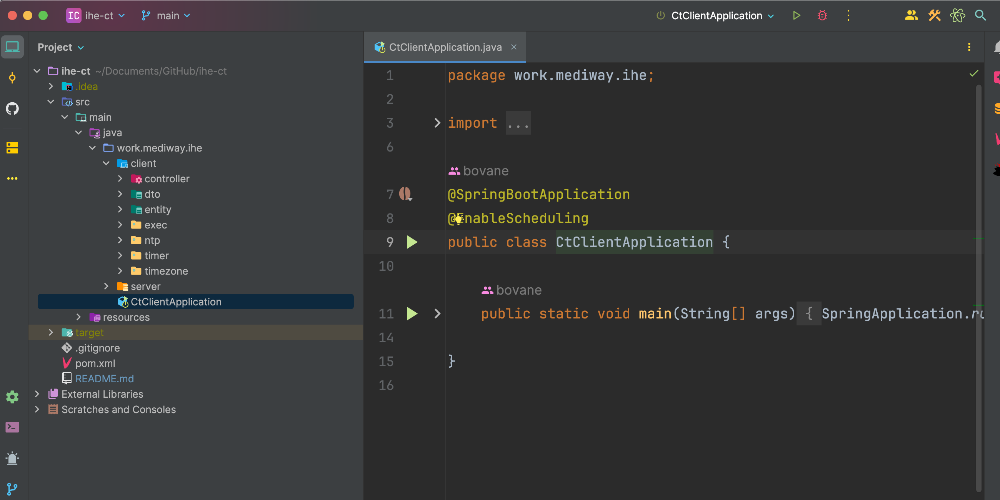

[TOC]

# README

## 1. 下载启动

### 1.1 环境需求

- JDK 8 以上
- maven 环境

### 1.2 运行项目

使用 `git clone https://github.com/bovane/ihe-ct.git` 下载项目到本地

使用 Intellij Idea 或者 Eclipse 打开项目,等待依赖加载完毕 **`(注意设置项目JDK版本)`**
运行 CtClientApplication.java 如下图所示

## 2. 测试

利用Postman即可测试, 注意由于外网服务器存在不稳定的情况,可能会出现请求报错

**可用两台电脑互相测试 (`IHE现场测评便是如此`,内网环境,两台电脑互相测试)**

### 2.1 getTime 接口

仅作展示NTP服务器时间

在postman中添加get方式接口
`http://127.0.0.1:8081/ntpAnysc/getTime?ntpServer=43.138.135.196`

其中ntpServer为外网时间服务器IP地址

### 2.2 getZone 接口

仅作展示NTP服务器时区

在postman中添加get方式接口

`http://127.0.0.1:8081/ntpAnysc/getZone?ntpServer=43.138.135.196`

其中ntpServer为外网时间服务器IP地址

### 2.3 syncTime

真正同步客户端时区和时间

在postman中添加get方式接口

`http://127.0.0.1:8081/ntpAnysc/syncTime?ntpServer=43.138.135.196`

其中ntpServer为外网时间服务器IP地址

## 3. 运行服务端

本地运行时间同步服务器服务端,需要同时运行 

1. SimpleNTPServer.java —— 提供同步时间的能力
2. ZoneServer.java —— 提供同步时区的能力

### 3.1 运行SimpleNTPServer

### 3.2 运行 ZoneServer

## 4. Windows权限

测试时,若遇见如下图权限问题;需要开启windows权限

可参照如下链接开启对应权限
[修改注册表,开始win32时间同步器权限](https://blog.csdn.net/zb455405775/article/details/80679514)

[Intellij Idea 开启管理员权限](https://blog.csdn.net/muzi_87/article/details/125823287)